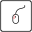

# Annotation commands

<!-- TODO : Insert picture or video -->

## 3D Bounding Box Labeling - Instructions

1. Hold Down the Ctrl key and draw 2D bounding box in the drawing area (below the camera image). A 3D bounding box will be generated automatically with default vehicle size. If the box contains more than 10 points, the rotation, scale and position of the object will be automatically predicted and adjusted.
2. Move/Scale the 3D bounding box using the red, green and blue arrow (drag and drop) or use the blue sliders in the side menu.
3. Choose one of the available classes in the bottom left corner (Car, Pedestrian, Bicycle, Motorcycle, Truck, Van, Bus, Trailer, Special_Vehicle)
4. Repeat steps 1-3 for all objects in the sequence
5. Download 2D and 3D labels, as well as projected 3D labels to your computer (as zip archive)

## Annotation tips & tricks

#### 1. Interpolation of objects (available in sequence mode)
  1. Select object to interpolate by clicking on a bounding box
  2. Activate 'Interpolation Mode' in the menu (checkbox) -> start position will be saved
  3. Move to desired frame by skipping x frames
  4. Translate object to new position
  5. Click on the 'Interpolate' button in the menu

#### 2. Grid view & 3D View
  1. Activate the grid in the side menu for better orientation
  2. Switch into 3D view to review your annotations and check for correct orientation

#### 3. Use keyboard short cuts (WIP)
| Key | Description   |
| --- | ------------- |
|         | Toggle view (3D view/Bird's-Eye-View)|
|         | Move forward in 3D view|
|         | Move left in 3D view|
|         | Move backward in 3D view|
|         | Move right in 3D view|
|         | Move down in 3D view|
|         | Move up in 3D view|
|        | Rotate camera counter-clock-wise |
|       | Rotate camera clock-wise |
|        | Rotate camera up |
|       | Rotate camera down |
|         | Enlarge camera image|
|         | Next frame     |
|         | Previous frame   |
|         | Interpolate    |
|        | Snap to grid in 0.5m steps (floor alignment mode)  |
|         | Enable/Disable Translation mode|
|         | Move selected object forward (Y++)|
|         | Move selected object to left (X--)|
|         | Move selected object backward (Y--)|
|         | Move selected object to right (X++)|
|         | Move selected object down (Z--)|
|         | Move selected object up (Z++)|
|         | Enable/Disable Rotation mode|
|        | Rotate selected object counter-clock-wise|
|         | Rotate selected object clock-wise|
|         | Enable/Disable Scaling mode |
|       | Increase length along longitudinal axis (y-axis)  |
|       | Decrease length along longitudinal axis (y-axis)  |
|        | Decrease width along lateral axis (x-axis) |
|        | Increase width along lateral axis (x-axis) |
|      ! | Increase height along vertical axis (z-axis) |
|      ! | Decrease height along vertical axis (z-axis) |
|    | Increase arrow size |
|    | Decrease arrow size |
|    | Show/Hide X-axis |
|    | Show/Hide Y-axis |
|    | Show/Hide Z-axis (only in 3D mode)|
|    | Switch between different operation modes (translate, rotate, scale) |
|    | Select next object |
|  OR  | Delete selected object |
|    | Marking mode (TODO)|
|    | Select class CAR |
|    | Select class Truck |
|    | Select class Trailer |
|    | Select class Van |
|    | Select class Motorcycle |
|    | Select class Bus |
|    | Select class Pedestrian |
|    | Select class Bicycle |
|    | Select class Special_Vehicle |
|  | On a 2D/3D object: Show bounding box|
|            | On a camera image: Enlarge/Shrink camera image (TODO)|
|            | On ego vehicle: Show field-of-view (TODO)|
| : | Switch FOV to next channel|
| | Reset all selected bounding boxes (TODO)|
|  | Full Screen Mode|
|  | Play video (TODO)||
|  | Keyboard navigation (only in 3D view) (TODO)|
|  | Toggle Lighting (TODO)|
|  | Label random color (TODO)|
|  | Label class color (TODO)|
|  | Show/Hide trajectory (TODO)|
| | Download annotation file (TODO)|
| | Undo operation |
| | Redo operation (TODO)|
|  | Show/Hide grid (TODO)|
|  | Hide all labels except selected object (Press again to show all labels) (TODO)|
|  | Show keyboard shortcuts|
|  | Unselect box |
| | Close tab (exit)|
|                                                                                                                               | Quit fullscreen cam image (TODO)|
|  | Copy bounding box (by dragging) (TODO)|

#### Hints:
+ Select `Copy label to next frame` checkbox if you want to keep the label (position, size, class) for next frame
+ Use helper views (available in point cloud mode) to align object along z-axis (no need to switch into 3D view)
+ Label one object from start to end (using interpolation) and then continue with next object (available in sequence mode)
+ Backup (download annotations) regularly to avoid loss of data in case of program crashes.
