# Labeling instructions

1. Either start from a single object and label the entire sequence (with interpolation) **OR** label all objects in a scene and move onto the next timestamp (while copying annotations) 
2. **Do not** apply more than one box to a single object. If there is a truck with a trailer, then put two boxes (one box for Truck and another one for Trailer). Both boxes should overlap.
3. Download the annotation file into the following folder: `proAnno/input/dataset/<CAMERA_CHANNEL>/<SEQUENCE>/annotations`
4. For every bounding box, include one of the following labels 9 :
   - Car
   - Truck
   - Trailer
   - Van
   - Motorcycle
   - Bus
   - Pedestrian
   - Bicycle
   - Special vehicle

The specific details of the classes are below. Detailed instruction on labeling each class can be found at the end of the document.

[<h2>1. Car</h2>](#car)

These include vehicles designed primarily for personal use, e.g. sedans, hatch-backs, wagons, vans, mini-vans, SUVs, jeeps and pickup trucks (a pickup truck is a light duty truck with an enclosed cab and an open or closed cargo area; a pickup truck can be intended primarily for hauling cargo or for personal use).

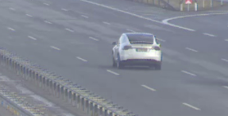

[<h2>2. Truck</h2>](#truck)

These are vehicles primarily designed to haul cargo including lorrys, trucks.

|Truck type | Example |
| -------- | ------- |
|Delivery Truck |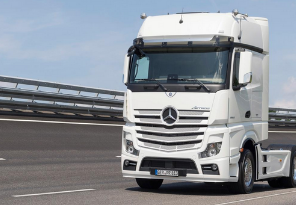 |
|Pickup Truck | 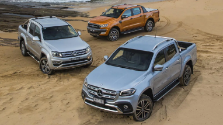 |

[<h2>3. Trailer</h2>](#trailer)

A trailer of type container/box/dump/vehicle_transporter/mixer/tank/flat_bed/other.

| Trailer Type    | Example |
| -------- | ------- |
| Container| 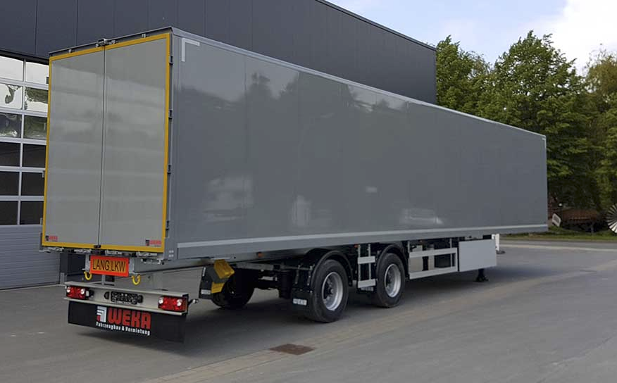 |
| Box | 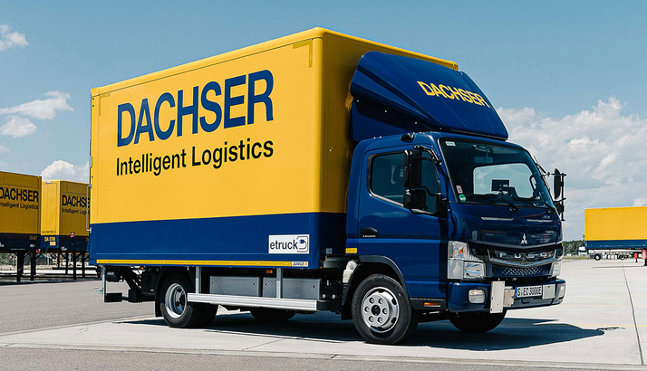|
| Dump|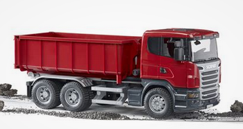|
|Vehicle Transport|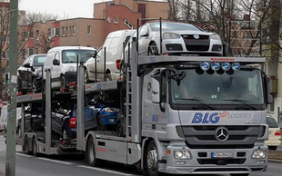|
|Mixer|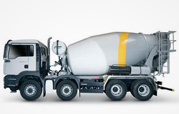|
|Tank|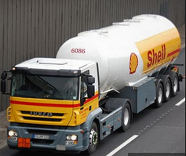|
|Flatbed|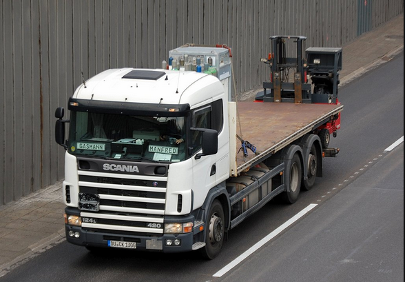|
|Other|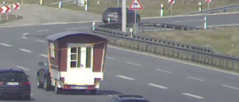|

[<h2>4. Van </h2>](#van)

Vans designed primarily for transporting something.

Examples :

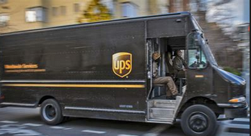

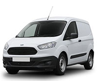

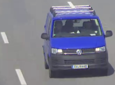

[<h2>5. Motorcycle </h2>](#motorcycle)

Gasoline or electric powered 2-wheeled vehicle designed to move rapidly (at the speed of standard cars) on the road surface. This category includes all motorcycles, vespas and scooters. It also includes light 3-wheel vehicles, often with a light plastic roof and open on the sides, that tend to be common in Asia (rickshaws). If there is a rider and/or passenger, include them in the box and set the attribute "with_rider".

|Motorcycle Type | Example |
|----------------|---------|
|Motorbike|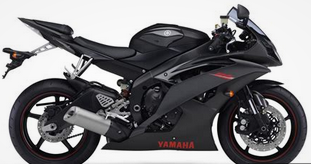|
|Scooter|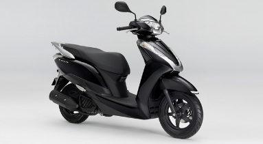|

[<h2>6. Bus </h2>](#bus)

Vehicles transporting more than 10 people.

|Bus Type | Example |
|----------------|---------|
|Rigid |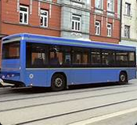 |
| Bendy |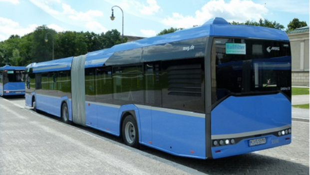 |

[<h2>7. Pedestrian </h2>](#pedestrian)
 <!-- TODO -->
An adult/child pedestrian moving around the cityscape. Mannequins should also be annotated as `Pedestrian`.

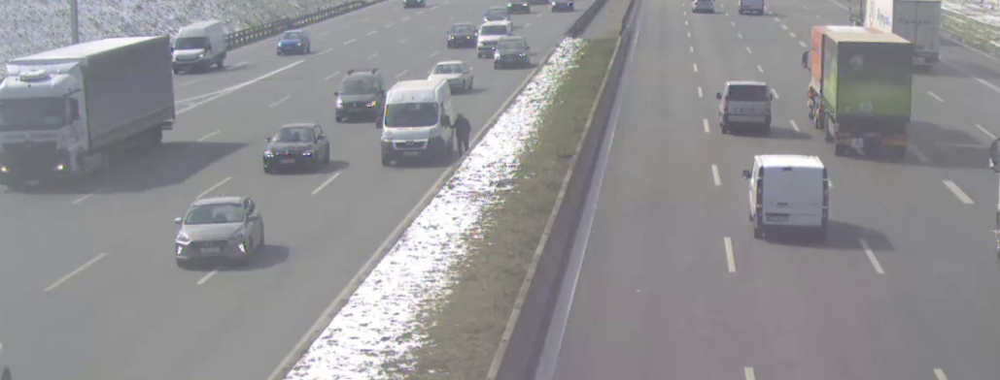

[<h2>8. Bicycle </h2>](#bicycle)

Human or electric powered 2-wheeled vehicle designed to travel at lower speeds either on road surface, sidewalks or bicycle paths. If there is a rider and/or passenger, include them in the box.

|Bicycle Type | Example |
|----------------|---------|
|without rider | 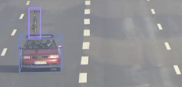 |
|with rider | 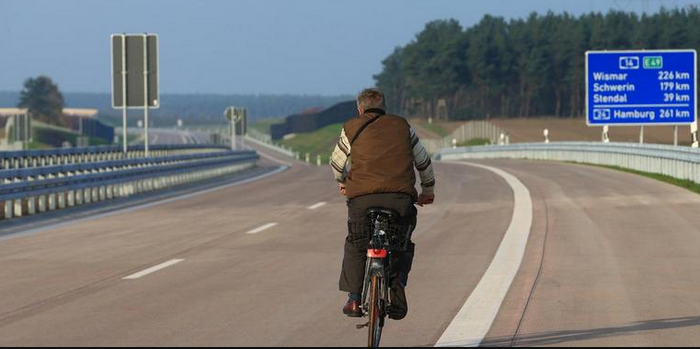 |

[<h2>9. Special vehicle </h2>](#specialvehicle)

A special vehicle (e.g. police car, ambulance, fire truck or tractor etc).

|Special vehicle Type | Example |
|----------------|---------|
|Ambulance | 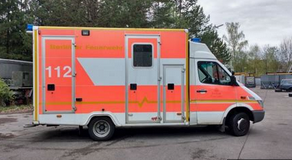 |
| Ambulance (with attribute flashing lights)| 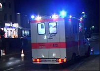 |
|Police vehicle | 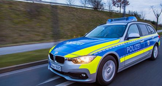 |
|Police vehicle (with attribute flashing lights) | 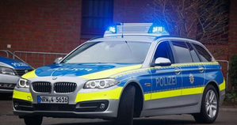 |
| Firetruck | 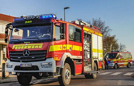 |
| Firetruck (with attribute flashing lights) | 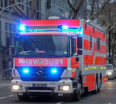 |
| Tractor | 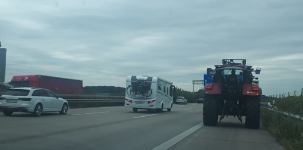 |
| Other | 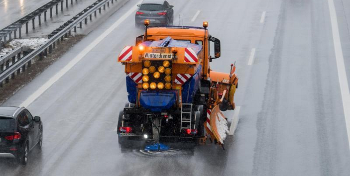 |

 # Detailed Instructions and Examples

Follow these instruction when labeling each class to avoid ambiguity.
<!-- Bounding Box color convention in example images:
 + **Green**: Objects like this should be annotated -->

## Car
+ Vehicle designed primarily for personal use, e.g. sedans, hatch-backs, wagons, vans, mini-vans, SUVs and jeeps.

+ If it is primarily designed to haul cargo it is a truck.

## Truck
+ Vehicles primarily designed to haul cargo including lorrys, trucks, pickup truck (a pickup truck is a light duty truck with an enclosed cab and an open or closed cargo area; a pickup truck can be intended primarily for hauling cargo or for personal use).

<!--  -->
<!--  -->

+ When a truck has a trailer, then both boxes should overlap a bit so that an enclosed box (truck+trailer) can be calculated in the post-processing step.

+ If you can see a truck from the front side, then only label it as truck with one bounding box and do not set the number of trailers.

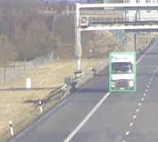

+ If you can see a truck from the back side, then only label it as trailer with one bounding box and select the corresponding trailer type attribute (e.g. container).

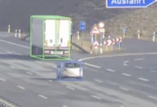

+ If you can see both (truck and trailer), then put 2 overlapping boxes and set the truck attribute "number_of_trailers" to the amount of trailers.

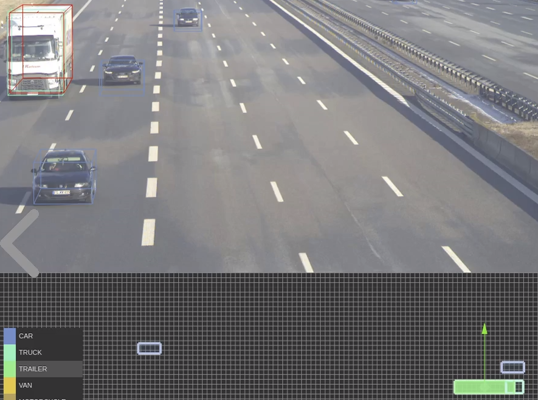

Pickup Truck:

 ## Motorcycle
+ Gasoline or electric powered 2-wheeled vehicle designed to move rapidly (at the speed of standard cars) on the road surface. This category includes all motorcycles, vespas and scooters. It also includes light 3-wheel vehicles, often with a light plastic roof and open on the sides, that tend to be common in Asia (rickshaws).
    + If there is a rider, include the rider in the box.
    + If there is a passenger, include the passenger in the box.
    + If there is a pedestrian standing next to the motorcycle, do NOT include in the annotation.

    
    
    
    
    
    
    
    

## Bicycle
+ Human or electric powered 2-wheeled vehicle designed to travel at lower speeds either on road surface, sidewalks or bicycle paths.
    + If there is a rider, include the rider in the box
    + If there is a passenger, include the passenger in the box
    + If there is a pedestrian standing next to the bicycle, do NOT include in the annotation

    
    
    
    

## Pedestrian
+ An adult/child pedestrian moving around the cityscape.
+ Mannequins should also be treated as pedestrian.

    
    
    
    
    
    
    
    
    
